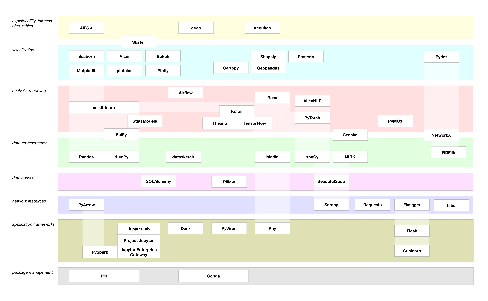
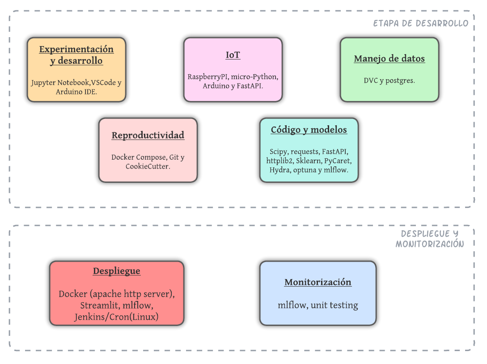

# Implementacion MLOps + IoT en Docker

Date Created: November 12, 2022 11:58 AM  
Epic: Seminarios Master  
Priority: High 🔥  
Status: In Progress  

# Revisión e implementación de un modelo mediante técnicas de MLOps  

***********************Arturo Sirvent Fresneda***********************  

### Resumen

El objetivo de este trabajo ha sido el de crear un documento que por un lado resuma las técnicas usadas para el despliegue automático de modelos de Machine Learning, y por otro lado, la implementación concreta en una área, haciendo uso de tecnologías disponibles para este propósito, como el uso de Docker, orquestación de contenedores y API REST entre otras.

El caso práctico concreto en el que se ha trabajado, ha sido el de un sensor de humedad colocado en el exterior, el cual envía de forma periódica información (mediante una API y protocolo HTTP) a un sistema centralizado donde la información se procesa. En dicho sistema centralizado, está corriendo un sistema automático que crea un modelo de predicción de los valores futuros de la humedad. Lo importante de todo esto, es que el modelo no es estático, y este se va validando con el tiempo y nuevos datos, de esta forma logramos el ******deploy****** de un modelo, el cual recibe los datos haciendo uso de tecnología IoT. 

*Nota: Sobre IoT no hubo ningún seminario, pero me parecía muy interesante realizar la implementación realista en la que los datos se deben de recibir de forma remota de algún sensor.*

---

## Introducción

Es indudable que en los últimos años se está llevando a cado la llamada “digitalización” de muchos procesos, entre estos no solo están las migraciones de la información a nuevos formatos digitales, sino que también se ha visto como poco a poco la sensorización el mundo del IoT y el **************edge computing************** ocupa más espacio en la industria. Pero esto automatiza la parte relativa a la obtención de la información, nos aun otro hueco que llenar con el procesado de dicha información. Aquí es donde entra en juego el MLOps, una serie de tecnologías y formad de trabajo que permiten contar con modelos de Machine Learning que produzcan resultados fiables pues están siendo monitorizados-reentrenados-revisados constantemente. Mediante estás tecnologias, el Ingeniero de MLOps  puede (con la ayuda de otros roles esenciales) montar una infraestructura donde todo el ciclo de vida **********************************datos crudos —> información********************************** puede ser automatizado, y de esta forma, se puede dedicar más tiempo a la tarea realmente esencial en una empresa (u otro organismo), la de transformar ******************información —> conocimiento.******************

El panorama de las tecnologías MLOps es abrumadoramente grande. Esta abundancia de recursos, paradójicamente puede hacer incluso más complicado aprender la disciplina, pues siempre se cuenta con la duda de si los recursos escogidos son los mejores y más versátiles. También el rápido desarrollo de metodologías, algoritmos, software, librerías etc., hace que sea muy fácil desactualizarse si no se mantiene una actitud de constante investigación y aprendizaje. 

Con la idea de prevenir esta desactualización, en este caso práctico se pretende hacer uso de la tecnologías de más bajo nivel posible, que aun hacen posible una implementación reducida y donde todos los pasos son personalizables y monitorizables. Es un poco este *****trade-off***** entre programación de alto nivel y bajo nivel el que se pretende buscar. Por ejemplo, no vamos a programar un protocolo de comunicación *machine to machine,* pero tampoco vamos a usar un medio de comunicación que ya este montado completamente, usaremos python y la librería ********FastAPI******** para dar soporte a esta necesidad de comunicación entre máquinas.

---

## Teoría sobre MLOps, y “*********Landscape*********” actual

MLOps nace como una variante de DevOps en la que se pretende usar esa metodología pero añadiendo modelos de *Machine Learning* (no confundir con DataOps que se centra más en la administración de los datos). 

Como pilares del MLOps podríamos poner:

.png)

No vamos a entrar en profundidad en cada uno de los pasos, pues hay muchos recursos en los cuales se extiende la idea de una forma muy extensa y rigurosa. En lugar de eso, creemos que es más útil tener un conocimiento sólido del flujo de trabajo, de la *********pipeline********* que se puede seguir al desarrollar un proyecto.  Añadiendo en cada caso, una panorámica de los recursos disponibles para ello.

---

## Metodología e Implementación del Caso Práctico

Mi caso práctico va a contar con los siguientes componentes:

Primero se escribió el código de la API Rest, usando FastAPI. Esto nos permitirá tener el sensor y la unidad de procesamiento o servidor, en lugares separados, esto es especialmente importante cuando tenemos varios sensores repartidos por ahí.

Los datos recogidos mediante los sensores, eran almacenados en sistema de base de datos relacional, escogí *Postgres*, pero cualquier otro podría haber funcionado (e.g. mySQl, Oracle ). Estos datos se versionaban usando DVC ( Nota: este paso es bastante innecesario para nuestro caso, sobre todo dada la naturaleza y la cantidad de datos con la que trabajamos, pero se pretender crear un entorno de trabajo lo más completo y versátil posible, para así conocer las tecnologías en casos futuros que presenten mayor complejidad). 

Una vez contaba con datos para crear los modelos, usando un IDE (jupyter notebook en mi caso), desarrollé el modelo usando las librerías mencionadas anteriormente.

Durante todo este proceso, se hizo un seguimiento del código con Git, y una estructuración del proyecto con CookieCutter. Docker se uso para la generación automática y simplificada de un entorno en el que poner a correr al modelo, un contenedor que esté escuchando a que nos comuniquemos con el por medio de la API y cuando se lo solicitemos, ejecute el modelo para devolvernos el resultado. De esta forma, con Docker compose, el contenedor puede ser creado desde cero cada vez que pongamos el sistema a funcionar, y siempre funcionará exactamente igual, lo único que necesitamos es conocer la manera correcta de comunicarnos con el mediante la API.

En este punto ya tenemos un modelo funcional y una forma de comunicarnos con el para obtener las predicciones. El siguiente paso es hacerlo accesible. Para ello, creamos una aplicación web usando Streamlit, que sería como el mejor equivalente a Shiny en Python. 

Tenemos 3 módulos separados que necesitan comunicarse para realizar la función completa: 

1. Contener en Docker, con el modelo listo para predecir.
2. El dispositivo IoT enviando datos mediante API Rest.
3. La interfaz web creada con Streamlit, capaz de interactuar con el usuario.

.png)

Lo siguiente fue, crear el código que une a los tres módulos. Este código lee de la base de datos que se está rellenando por el sensor IoT. Pasa eso datos al modelo y recibe la predicciones, y finalmente las muestras por la interfaz gráfica. Entre medias, se permite que la interfaz gráfica modifique algunos argumentos internos para que por ejemplo, la predicción se haga a 5 días futuros y no a 1 etc. 

Por último, el despliegue se hace con un servidor apache que es el encargado de “mostrar” todo al internet, para poder ser accedido por los usuarios. Y para actualización automática de datos y su monitorización (y reentreno si los resultados del modelo empeoraran mucho) se realiza con Cron(Linux) y mlflow.

---

## Resultados Caso Práctico y Conclusiones

Me ha sido imposible redactar la implementación a tiempo, esta se puede encontrar en:

[https://github.com/ArturoSirvent/Easy_Docker_MLOps_implementation](https://github.com/ArturoSirvent/Easy_Docker_MLOps_implementation)

---
